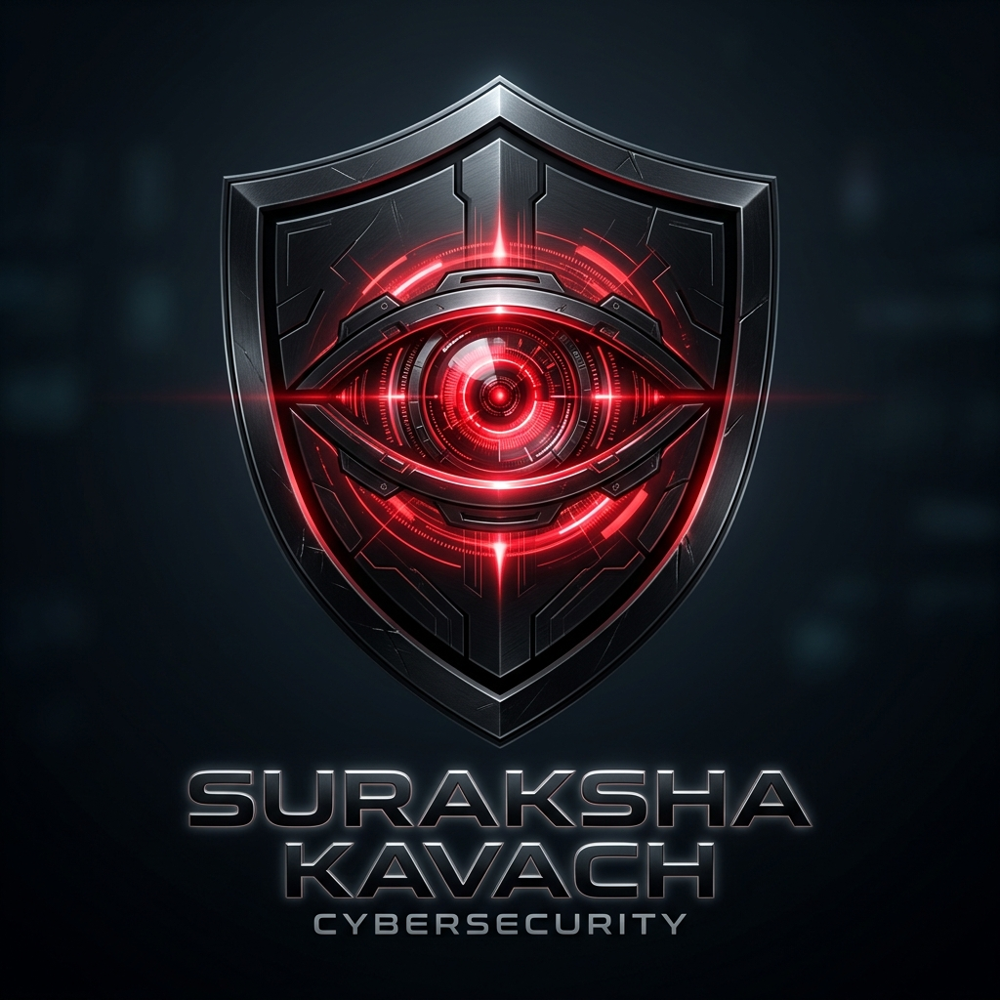

  
  
  <h1>🛡️ SURAKSHA KAVACH 3.0</h1>
  
<b>A Sovereign, Zero-Cloud LAN Shield for Family Cyber-Defense</b>

  
  
  

 

## 🔐 Project Philosophy & Architecture

**Suraksha Kavach** (Hindi for *Security Shield*) is an elite-tier cyber defense application engineered to protect vulnerable demographics (especially seniors and teenagers) from SMS scams, phishing links, and digital fraud infrastructure.

Unlike conventional antivirus applications that secretly harvest your private messages to cloud endpoints, **Suraksha Kavach operates on a sovereign, Zero-Cloud Local Area Network (LAN) mesh.** Every phone in your family securely binds to a single local Admin Node (e.g., the tech-savvy child's phone) entirely through encrypted UDP/HTTP tunnels over your local Wi-Fi. Personal data never leaves the house.

---

## ✨ Core Elite Features

### 🧓 1. Senior Shield (Elderly Accessibility Mode)
Designed purely for digital accessibility and cognitive ease.
* **Simplified High-Contrast UI:** Removes complex telemetry graphs in favor of a large, visually absolute status (Safe / Dangerous).
* **Automatic Native Voice Alerts:** A deeply integrated Text-To-Speech (`flutter_tts`) engine securely tied to the UI frame lifecycle perfectly speaks the AI's safety verdicts out loud the exact millisecond a message is processed. 
* **Dynamic Bilingual Synthesis:** Fully supports Hindi (`hi-IN`) and English. If the phone is set to Hindi via the Settings tab, the App translates flawlessly *and* the Voice Alert engine dynamically swaps syntax arrays to speak native Hindi.
* **Panic Triggers:** Contains oversized 1-tap buttons to immediately ping the Admin child or call the National Cyber Helpline (1930).

### 🧠 2. On-Device AI Threat Engine
Achieves zero-latency inference completely offline. 
* **Model Pipeline:** Powered by a Quantized DistilBERT Transformer (`sms_fraud_model_quantized.tflite`).
* **Semantic Vectoring:** Understands the *intent* of an SMS instead of just matching rigid keywords—sniffing out urgency manipulation, fake bank alerts, and malicious short-links.

### 🏢 3. Command Node (Admin Cyber Center)
The ultimate bird's-eye view of your household's digital surface area.
* **Family Cyber Score:** A live algorithmic health gauge computing the defensive posture of all connected nodes.
* **Live Threat Intelligence Feed:** Intercepts and logs real-time scam attempts against any connected family member, mapping the exact threat category and risk scale.
* **Emergency Lockdown Broadcast:** Push emergency alerts to all family devices instantly if a coordinated phishing attack strikes.

### 🌐 4. Cloud Collaborative Threat Reporting
While purely localized by default, users can opt-in to combat scammers globally.
* **Firestore Verification System:** Members can actively identify, flag, and report sophisticated scam numbers/links up to a centralized Firebase Cloud Firestore repository.
* **Global Pooling:** This community verification safely strengthens global detection signatures over time without compromising private SMS content.

### 📶 5. Bulletproof Local Syncing
* **QR Handshake:** Seamlessly binds nodes bypassing confusing IP architectures simply by generating an encrypted Node QR Code.
* **Sovereign Transfer:** Uses raw Flutter `shelf` REST routes locally so threat metadata executes across the room safely and privately.

---

## 🚀 Getting Started & Deployment

To execute the application and witness the LAN mesh in real life, you will need two standard Android devices connected to the same Wi-Fi layer.

> [!TIP]
> **Pro-Tip for Corporate / Hackathon Wi-Fi:** Many public Wi-Fi networks enable 'Client Isolation' preventing devices from seeing each other. Turn on a **Mobile Hotspot** on Device A, and connect Device B to it to bypass this entirely!

### 📡 Setting up the Admin Node (Device 1)
1. Launch **Suraksha Kavach** and click **Admin Panel**.
2. Navigate to the **Family Shield** Tab.
3. Tap **GENERATE INVITE QR**. This initiates an invisible, lightweight `shelf` server operating on port `:8080`.

### 📱 Connecting the Member Node (Device 2)
1. Launch the app and click **User Panel**.
2. Select **Scan Admin QR** and point the camera at Device 1.
3. Once the handshake verifies, hit the **DEMO: SEND MOCK SCAM ALERT** button in the dashboard.
4. **Watch the magic:** Device 1's Admin Cyber Score will drop in absolute real-time as the threat packet safely traverses your local airwaves!

### 🧪 Important Testing Disclaimer: SMS vs. RCS
Please note that if you are testing the app by sending texts from another modern Android phone, your device might be using **RCS (Rich Communication Services / Chat features)** instead of standard SMS.
* The Android `SMS_RECEIVED` broadcast API strictly intercepts legacy cellular SMS traffic. It **cannot intercept RCS traffic** (messages sent over data/WiFi).
* Because iOS currently defaults to traditional SMS when texting Android devices, texts sent from iPhones will trigger the app's detection completely seamlessly.
* **To test detection from an Android device:** You must temporarily disable "RCS Chats" in your Android Messages settings to force the device to fallback to a traditional, interceptable SMS.

---

## 🛠️ Complete Technical Infrastructure

| Framework / Tool | Architecture Layer | Integration Purpose |
|------------------|--------------------|---------------------|
| **Flutter (Dart)** | Client Layer | Unified, 120hz cross-platform visual synthesis. |
| **TensorFlow Lite**| AI Engine | Asynchronous, offline DistilBERT NLP inference. |
| **Shelf / Http** | Local Networking | Peer-To-Peer REST API bound to local IP vectors. |
| **Cloud Firestore**| External Services| Opt-in global reporting & collaboration pool. |
| **Provider** | State Management | Deeply nested, reactive variable passing. |
| **Flutter TTS** | Accessibility | Automatic, native dual-language speech parsing. |
| **Go Router** | Deep Linking | Stateful widget tracking for absolute stability. |

---
*Developed proudly to democratize digital safety across generations.* 🛡️🇮🇳
